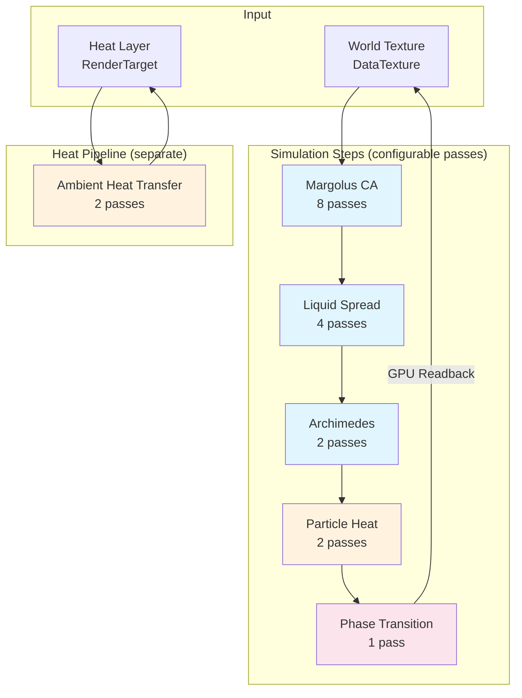
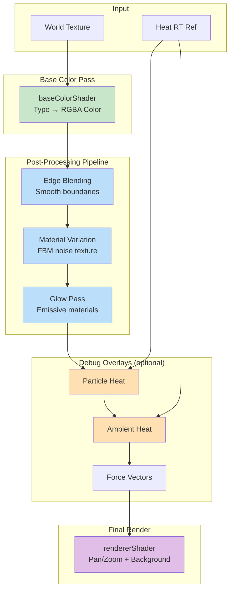
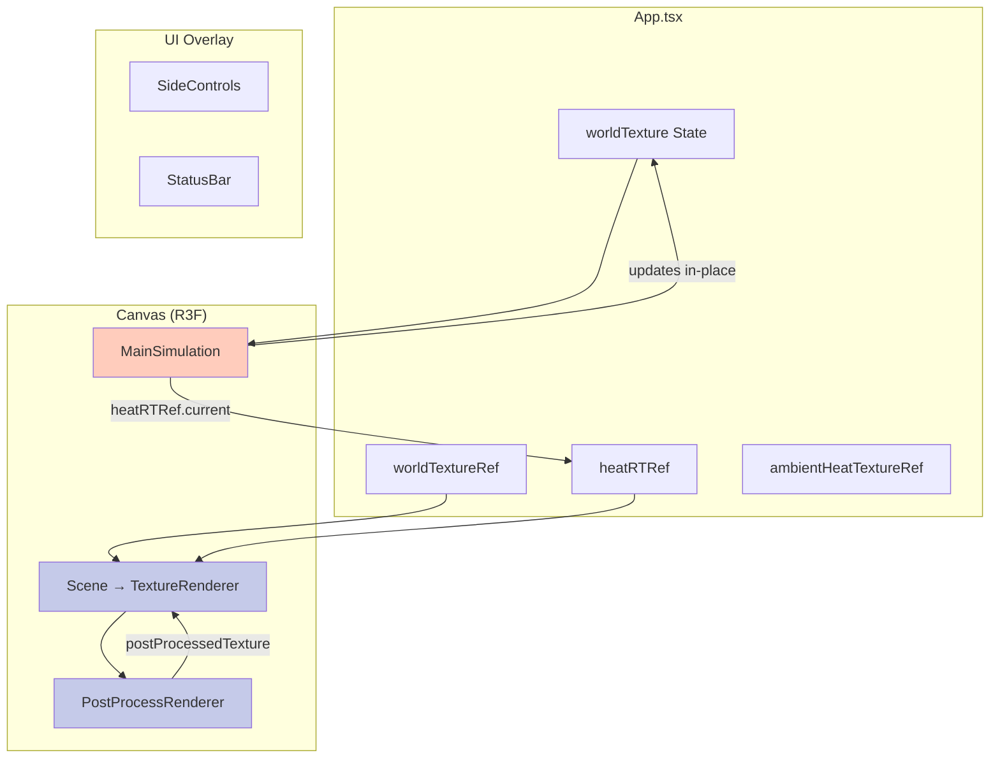

# Sandy - GPU-Accelerated Particle Simulation

A real-time particle simulation using WebGL/Three.js with GPU-accelerated cellular automata. The project simulates falling sand, liquids, gases, heat transfer, and phase transitions entirely on the GPU.

## Project Overview

**Tech Stack:**
- React 18 + TypeScript + Vite
- Three.js / @react-three/fiber for WebGL rendering
- GLSL shaders for GPU-accelerated simulation
- Ping-pong rendering pattern for state updates

**Key Features:**
- Margolus neighborhood cellular automata for realistic granular physics
- Multi-phase materials (solid, liquid, gas) with phase transitions
- Temperature simulation with heat diffusion and conduction
- Buoyancy and density-based fluid displacement
- Post-processing visual effects (glow, edge blending, noise variation)

---

## Directory Structure

```
src/
├── App.tsx                    # Main application component
├── main.tsx                   # Entry point
├── components/
│   ├── MainSimulation.tsx     # Core simulation loop (GPU compute)
│   ├── TextureRenderer.tsx    # Final rendering to screen
│   ├── PostProcessRenderer.tsx # Visual effects pipeline
│   ├── SideControls.tsx       # UI controls panel
│   ├── StatusBar.tsx          # FPS and status display
│   └── SimulationControls.tsx # Simulation parameter controls
├── hooks/
│   ├── useParticleDrawing.ts  # Mouse interaction for drawing particles
│   ├── useTextureControls.ts  # Pan/zoom controls
│   └── useCanvasSize.ts       # Canvas sizing
├── shaders/
│   ├── margolusShaders.ts     # Margolus CA for gravity/falling
│   ├── liquidSpreadShaders.ts # Horizontal liquid spreading
│   ├── archimedesShaders.ts   # Buoyancy/density displacement
│   ├── ambientHeatTransferShaders.ts  # Environmental heat diffusion
│   ├── particleOnlyHeatShaders.ts     # Direct particle heat transfer
│   ├── phaseTransitionShaders.ts      # Boiling/freezing/melting
│   ├── forceTransferShaders.ts        # Force propagation (disabled)
│   ├── baseColorShader.ts     # Particle type → color mapping
│   ├── postProcessShaders.ts  # Edge blending, noise, glow
│   ├── overlayShaders.ts      # Heat/force visualization
│   ├── rendererShader.ts      # Final display shader
│   ├── margolusShaderUtils.ts # Shared Margolus utilities
│   ├── temperatureShaderUtils.ts # Temperature encode/decode
│   └── noiseUtils.ts          # Simplex/FBM noise functions
├── types/
│   ├── SimulationConfig.ts    # Simulation step configuration
│   ├── RenderConfig.ts        # Post-processing configuration
│   └── Level.ts               # Level save/load types
├── world/
│   ├── ParticleTypes.ts       # Particle type enum and colors
│   ├── ParticleTypeConstants.ts # Type range constants for shaders
│   ├── MaterialDefinitions.ts # Material properties (density, friction, thermal)
│   ├── RenderMaterialProperties.ts # Glow strength per material
│   └── WorldGeneration.ts     # World initialization
├── utils/
│   ├── LevelLoader.ts         # Load levels from files
│   ├── LevelSaver.ts          # Save levels to files
│   └── temperatureUtils.ts    # Temperature conversion utilities
└── constants/
    └── worldConstants.ts      # World size (1024x1024)
```

---

## Data Flow Architecture

### Texture Formats

**Particle State Texture (DataTexture, RGBA8):**
```
R = Particle Type (0-255)
G = Temperature Low Byte
B = Temperature High Byte
A = Unused (255)
```
Temperature is 16-bit Kelvin encoded across G+B channels.

**Heat/Force Layer Texture (WebGLRenderTarget, RGBA8):**
```
R = Ambient Temperature Low Byte
G = Ambient Temperature High Byte
B = Force X (128 = neutral)
A = Force Y (128 = neutral)
```

### Particle Type Ranges

```
0-15:    EMPTY (air, void)
16-32:   STATIC (stone, glass, heater - immovable)
33-63:   SOLID (sand, dirt, gravel, ice - movable granular)
64-111:  LIQUID (water, lava, oil, acid, slime)
112-159: GAS (steam, smoke, nitrogen)
```

---

## Simulation Pipeline

The simulation runs entirely on the GPU using ping-pong rendering between WebGLRenderTargets.



### Simulation Steps Detail

#### 1. Margolus Cellular Automata (`margolusShaders.ts`)
- **Purpose:** Gravity and granular physics for falling particles
- **Algorithm:** Probabilistic 2x2 block cellular automata
- **Key Features:**
  - Per-material friction coefficients
  - Randomized transition order to prevent directional bias
  - Handles solids, liquids, and gases with different behaviors
- **Transitions:** Particles fall, topple, and pile naturally

#### 2. Liquid Spread (`liquidSpreadShaders.ts`)
- **Purpose:** Horizontal spreading behavior for liquids and gases
- **Key Features:**
  - Liquids spread horizontally when supported
  - Liquids cascade diagonally into gaps
  - Gases spread horizontally under ceilings (inverse behavior)

#### 3. Archimedes (`archimedesShaders.ts`)
- **Purpose:** Buoyancy and fluid displacement
- **Key Features:**
  - Solids sink through liquids
  - Denser liquids sink below lighter liquids
  - Temperature-aware convection (hot fluids rise)
  - Uses `computeEffectiveDensity()` combining base density + temperature

#### 4. Particle Heat Transfer (`particleOnlyHeatShaders.ts`)
- **Purpose:** Direct heat exchange between particles
- **Key Features:**
  - Particles emit/absorb heat based on thermal conductivity
  - Uses heat layer coupling for environmental exchange
  - Fast particle-to-particle conduction

#### 5. Phase Transitions (`phaseTransitionShaders.ts`)
- **Purpose:** Material state changes based on temperature
- **Transitions:**
  - **Boiling:** liquid → gas (water→steam, lava→smoke)
  - **Condensation:** gas → liquid (steam→water)
  - **Freezing:** liquid → solid (water→ice, lava→basalt/obsidian)
  - **Melting:** solid → liquid (ice→water, basalt→lava)

#### 6. Ambient Heat Transfer (`ambientHeatTransferShaders.ts`)
- **Purpose:** Environmental heat diffusion (heat layer)
- **Key Features:**
  - Particles emit heat to environment based on thermal capacity
  - Environment diffuses heat via 5x5 neighbor sampling
  - Equilibrium force pulls toward room temperature
  - Separate ping-pong targets from particle simulation

---

## Rendering Pipeline



### Rendering Stages

#### 1. Base Color (`baseColorShader.ts`)
- Maps particle types to RGBA colors
- Auto-generated from `ParticleColors` dictionary
- Renders to intermediate RenderTarget

#### 2. Edge Blending (`postProcessShaders.ts`)
- Samples neighboring pixels
- Blends colors at material boundaries
- Configurable blend strength

#### 3. Material Variation (`postProcessShaders.ts`)
- Applies FBM (Fractional Brownian Motion) noise
- Prevents flat uniform color blocks
- Configurable scale and strength

#### 4. Glow Pass (`postProcessShaders.ts`)
- Per-material glow strength (lava, heaters, etc.)
- Samples neighbors to create bloom effect
- Additive blending for emissive materials

#### 5. Heat/Force Overlays (`overlayShaders.ts`)
- Debug visualization modes
- Particle heat: temperature-based coloring
- Ambient heat: environmental temperature map
- Force vectors: directional force visualization

#### 6. Final Renderer (`rendererShader.ts`)
- Handles pan/zoom transformations
- Composites background (procedural or texture)
- Outputs to screen

---

## Material System

### Material Attributes (`MaterialDefinitions.ts`)

Each particle type has configurable properties:

| Property | Description | Range |
|----------|-------------|-------|
| `density` | Mass per volume (affects buoyancy) | 0-10000 |
| `viscosity` | Flow resistance | 0-2000 |
| `friction` | Topple probability in Margolus CA | 0.0-1.0 |
| `meltingPoint` | Temperature for solid→liquid | Kelvin |
| `boilingPoint` | Temperature for liquid→gas | Kelvin |
| `thermalCapacity` | Heat retention (1.0 = never loses heat) | 0.0-1.0 |
| `thermalConductivity` | Heat transfer rate (1.0 = instant) | 0.0-1.0 |
| `glowStrength` | Emissive intensity for rendering | 0.0-1.0 |
| `defaultTemperature` | Initial temperature when spawned | Kelvin |

### Phase Transitions (`PhaseTransitions`)

Defines state change mappings:
```typescript
[ParticleType.WATER]: {
  boilsTo: STEAM,
  freezesTo: ICE,
  meltsTo: -1,      // -1 = no transition
  condensesTo: -1
}
```

---

## Configuration

### SimulationConfig (`types/SimulationConfig.ts`)

```typescript
interface SimulationConfig {
  steps: SimulationStep[];        // Ordered simulation passes
  frictionAmplifier: number;      // Global friction modifier
  ambientHeatSettings: {
    emissionMultiplier: number;   // Particle → environment rate
    diffusionMultiplier: number;  // Environment spread rate
    equilibriumStrength: number;  // Room temp pull strength
    equilibriumTemperature: number; // Target temp (298K = 25°C)
    heatmapCouplingMultiplier: number; // Particle ↔ heatmap coupling
  };
}
```

### RenderConfig (`types/RenderConfig.ts`)

```typescript
interface RenderConfig {
  effects: RenderEffect[];  // Edge blending, variation, glow
  overlays: Overlay[];      // Heat, force visualizations
  edgeBlending: { blendStrength: number };
  materialVariation: { noiseScale: number; noiseStrength: number };
  glow: { intensity: number; radius: number };
}
```

---

## Component Architecture



### Key Components

#### MainSimulation.tsx
- Runs the simulation loop in `useFrame`
- Manages ping-pong RenderTargets
- Executes shader passes in order
- Single GPU readback at end of frame
- Updates `worldTexture.image.data` in-place

#### TextureRenderer.tsx
- Receives `textureRef` (not prop) for performance
- Manages base color rendering
- Delegates to PostProcessRenderer
- Final output to screen via rendererShader

#### PostProcessRenderer.tsx
- Receives `stateTextureRef` and `heatTextureRef`
- Chains effects: Edge → Variation → Glow → Overlays
- Returns final texture via `onRenderComplete` callback

---

## Performance Optimizations

### Ref-Based Texture Passing
Textures are passed via React refs instead of props to avoid re-renders:
```typescript
const worldTextureRef = useRef<DataTexture>(worldTexture);
// Updated in useFrame, not triggering React reconciliation
```

### Single GPU Readback
All particle simulation steps chain before a single `gl.readRenderTargetPixels`:
```
Margolus → LiquidSpread → Archimedes → ParticleHeat → PhaseTransition → READBACK
```

### Separate Heat Pipeline
Heat layer uses its own ping-pong targets, avoids unnecessary particle data copies.

### In-Place Texture Updates
`worldTexture.image.data.set(pixels)` + `needsUpdate = true` instead of creating new textures.

---

## Shader Utilities

### Temperature Encoding (`temperatureShaderUtils.ts`)
```glsl
// Decode 16-bit temperature from two bytes
float decodeParticleTemperature(vec4 data) {
  return data.g * 255.0 + data.b * 255.0 * 256.0;
}

// Encode temperature to two bytes
vec2 encodeTemperature(float temp) {
  float low = mod(temp, 256.0);
  float high = floor(temp / 256.0);
  return vec2(low / 255.0, high / 255.0);
}
```

### Material Property Lookup
Generated GLSL arrays indexed by particle type:
```glsl
const float MATERIAL_FRICTIONS[256] = float[256](...);
const float MATERIAL_DENSITIES[256] = float[256](...);
const float MATERIAL_THERMAL_CONDUCTIVITIES[256] = float[256](...);

float getMaterialFriction(float particleType) {
  return MATERIAL_FRICTIONS[int(particleType)];
}
```

---

## World Generation

`WorldGeneration.ts` provides initialization patterns:
- `EMPTY`: Blank world
- `AXIS`: X/Y axis lines for testing
- `HOURGLASS`: Classic falling sand test
- `PLATFORMS`: Multiple platforms with materials

Particles are set with their default temperatures from `MaterialDefinitions`.

---

## User Interaction

### Mouse Drawing (`useParticleDrawing.ts`)
- Screen coordinates → world texture coordinates
- Circular brush with configurable size
- Tool modes: Add, Remove, Inspect, Fill
- Shift-click for inspect mode
- Throttled inspection updates (500ms)

### Controls
- Pan: Drag with mouse
- Zoom: Scroll wheel (changes `pixelSize`)
- Draw: Left click
- Inspect: Shift + hover

---

## Key Constants

```typescript
WORLD_SIZE = 1024           // Texture dimensions
KELVIN_OFFSET = 273         // 0°C in Kelvin
ROOM_TEMPERATURE_K = 298    // 25°C
MAX_TEMPERATURE = 65535     // 16-bit max
```
