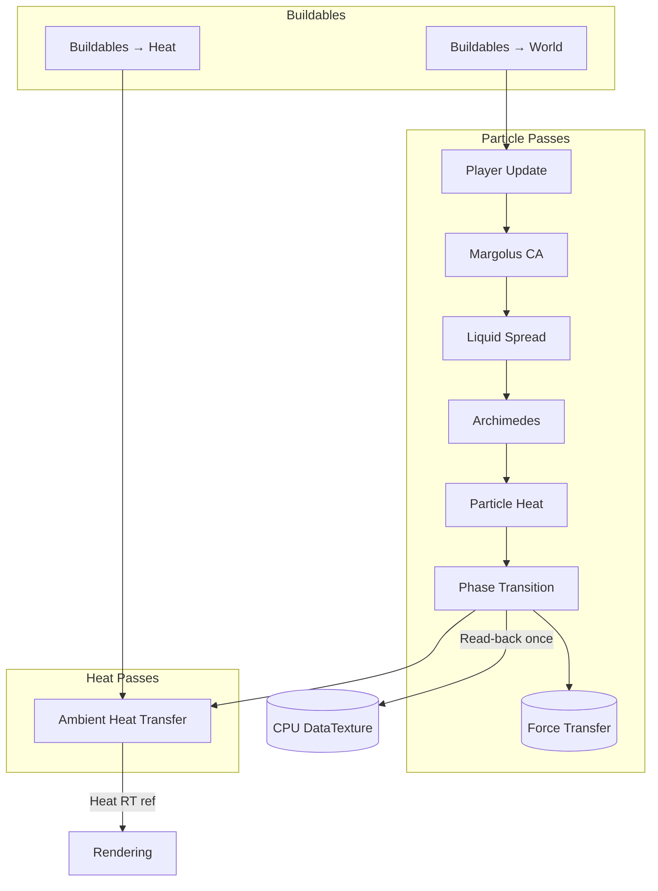
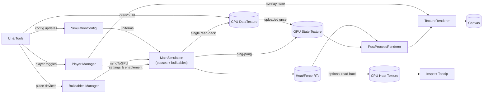

## Architecture Overview

Sandymarton is a TypeScript + WebGL sandbox that keeps the full physics and rendering loop on the GPU while React handles configuration, controls, and orchestration. The updated architecture integrates buildable devices, dual heat pipelines, and post-processing overlays without introducing extra CPU/GPU sync points.

## Core Design Pillars

- **GPU-first workloads** – Every simulation rule, heat exchange, and post-effect runs inside GLSL shaders invoked through Three.js.
- **Ping-pong buffers everywhere** – Particle, heat, buildable, and render pipelines share pairs of reusable render targets to prevent read-modify-write hazards.
- **Config-driven orchestration** – `SimulationConfig` defines pass ordering, enabling or disabling steps without recompiling shaders.
- **Single read-back loop** – The world state returns to CPU memory once per frame only after all particle passes finish; optional heat read-backs occur on demand for inspection tools.
- **Buildables as first-class citizens** – The buildables manager streams texture data into two GPU passes that can spawn particles or inject heat before the core physics steps run.

## Simulation Layer

### Runtime Entry Point – `MainSimulation.tsx`

- Allocates particle, heat, and post-buildable render targets sized to `textureSize`.
- Seeds a persistent `DataTexture` (`heatForceLayerRef`) with per-material default temperatures so new worlds start in thermal equilibrium.
- Reuses a shared `createSimulationResources` helper to create materials that differ only by shader pairings.
- Tracks FPS with a circular buffer and surfaces the value through a callback consumed by the HUD.

### Buildables Integration

Two dedicated passes run before the configurable particle pipeline whenever buildables are active:

1. **Buildables → World** – Uses `buildablesToWorldShader` to spawn or remove particles (sources, sinks, emitters). Writes into the particle ping-pong chain so subsequent passes see the changes immediately.
2. **Buildables → Heat** – Projects heater/cooler effects from devices into the heat/force texture, piggybacking on the same render target pool as ambient diffusion.

The buildables manager keeps position/data textures and exposes a `syncToGPU()` method that uploads edits triggered by UI interactions or scripts just before the frame executes.

### Player Simulation Stage

- `PlayerManager` owns the articulated character, storing position, velocity, walk phase, and runtime-adjustable settings (speed, gravity, push-out force).
- `MainSimulation` executes a dedicated `player-update` shader right after the buildable passes. The shader samples the current world state, resolves collisions, and writes results into a 4×4 floating-point render target for CPU consumption.
- The world texture remains untouched; the renderer draws the player as an overlay sprite using live uniforms sourced from `PlayerManager`.
- When the player is disabled the pass short-circuits, keeping the pipeline cost identical to pre-player builds.

### Particle Pipeline

Particle-focused passes mutate the world texture using four rotating render targets. After buildables and (optionally) the player logic run, the default ordering is:

1. **Margolus Cellular Automaton** – Granular settling and friction-controlled randomness.
2. **Liquid Spread** – Directional liquid leveling with stochastic variance.
3. **Archimedes Buoyancy** – Density- and temperature-aware swapping to simulate convection.
4. **Particle-only Heat Diffusion** – Fast conduction between neighbors, factoring in ambient coupling when enabled.
5. **Phase Transitions** – Material swaps driven by temperature thresholds.
6. **Force Transfer (optional)** – Experimental force propagation path, off by default but sharing the resource factory.

Each shader reads `uCurrentState`, writes to the next render target, and updates iteration counters that drive alternating checkerboard patterns or random seeds. Once all passes finish, a single `gl.readRenderTargetPixels` call refreshes the CPU-side `worldTexture` so drawing tools, analytics, and level saving stay in sync without double buffering on the CPU.

### Heat & Force Pipeline

- Stores temperature (16-bit Kelvin) and force vectors in an RGBA texture shared across passes.
- Maintains two heat render targets for ping-pong diffusion while the original `DataTexture` remains the authoritative CPU copy.
- Applies ambient diffusion, emission, and optional equilibrium nudging using uniforms sourced from `config.ambientHeatSettings`.
- Defers equilibrium updates based on `equilibriumInterval` so idle frames skip unnecessary work.
- Optionally reads the heat target back to CPU memory when inspection tooling toggles `shouldCaptureHeatLayer`.
- Shares the final heat target through `heatRTRef`, allowing render overlays to visualize temperatures and forces without GPU read-back.

### Execution Order Diagram

## Rendering Layer

### `TextureRenderer.tsx`

- Projects either the raw particle state or the post-processed color texture to a screen-filling quad.
- Supplies uniforms for pixel size, camera center, and background metadata while animating liquids via a time uniform.
- Seeds procedural backgrounds with random palette + noise offsets (`createBackgroundParams`) whenever worlds reset or new levels load.

### Base Color Pre-pass

When `renderConfig` enables post-processing, a dedicated base color render target stores material coloration so visual effects never mutate the canonical state texture.

### `PostProcessRenderer.tsx`

- Reads live textures through refs, avoiding React re-render churn.
- Splits effects into “core” and “glow” buckets so additive bloom always executes last.
- Supports edge blending, material variation noise, glow, and three overlay options (particle heat, ambient heat, force vectors). When both heat overlays are active the combined shader renders them in a single pass.
- Ping-pong render targets recycle across effects to keep GPU allocations bounded.

### Background Shader

- Applies the selected palette, seed, and noise offsets across a short sequence of noise evaluations driven by elapsed time.
- Exposes uniforms for toggling the background entirely (e.g., screenshot mode) without incurring extra passes.

## UI & Tooling Layer

- **`SideControls.tsx`** – Central hub for particle selection, buildable placement, render toggles, and heat tuning.
- **`SimulationControls.tsx`** – Adjusts pass counts, friction amplifier, and pause/reset behavior.
- **`useTextureControls`** – Handles scroll-wheel zoom, right-click panning, and exposes a `centerRef` so the player follow loop can steer the camera without incurring React re-renders.
- **`useParticleDrawing`** – Mirrors shader math to convert screen coordinates to world coordinates, performs circular brush edits directly on the CPU-side texture, and surfaces inspection data that merges particle and ambient temperatures.
- **`ParticleCounter.tsx`** – Uses a reusable typed-array accumulator to produce aggregate counts on a throttled timer.
- **`StatusBar.tsx`** – Displays FPS, current material, and exposes simulation toggles including the player enable switch and per-player tuning sliders.
- **`usePlayerInput`** – Captures keyboard state (movement, jump, crouch placeholders) and streams it into the GPU player update stage when enabled.
- **Buildables Manager** – Stores up to `BUILDABLES_TEXTURE_WIDTH × BUILDABLES_TEXTURE_HEIGHT` device slots and exposes sync hooks for both CPU edits and GPU consumption.

## Data Flow

## Texture Inventory

| Texture                        | Format          | Producer                             | Consumers                        | Notes                                                                     |
| ------------------------------ | --------------- | ------------------------------------ | -------------------------------- | ------------------------------------------------------------------------- |
| World state (ping-pong×4)      | RGBA8           | Particle passes, buildables → world  | Simulation pipeline, CPU sync    | Stores particle type, 16-bit temperature, metadata.                       |
| Heat/force RTs (ping-pong×2)   | RGBA8           | Buildables → heat, ambient diffusion | Post-process overlays, inspector | Temperature low/high bytes + force vectors; CPU copy refreshed on demand. |
| Base color RT                  | RGBA8           | Base color pre-pass                  | Post-processing pipeline         | Only allocated when effects enabled.                                      |
| Post-process RTs (ping-pong×2) | RGBA8           | Post-process renderer                | TextureRenderer                  | Reused for every effect/overlay to cap allocations.                       |
| Buildables position/data       | RGBA8 / RGBA32F | Buildables manager                   | Buildables shaders               | Fixed-size texture atlas describing device placement & parameters.        |

## Performance Practices

- Materials and geometries are created once and disposed on unmount to avoid shader recompilation churn.
- Buildable passes short-circuit when `count === 0`, so empty worlds skip the additional render steps.
- Heat read-back only occurs when the inspector is active, preserving bandwidth during normal play.
- Glow executes last to reduce overdraw, and disabled effects skip both render target swaps and shader dispatches.
- All render targets use `NearestFilter` and omit depth/stencil attachments for 2D precision with minimal bandwidth.
- Friction amplification is exposed through the UI so heavy worlds can be stabilized without touching shader code.

## Threading Model

- **Main thread** – React reconciliation, event handling, WebGL command submission, buildables synchronization.
- **GPU** – Executes shader programs for buildables, particle passes, heat diffusion, and rendering effects in parallel.
- **No Web Workers** – GPU parallelism handles the heavy lifting; CPU tasks (drawing, analytics) are throttled and vectorized.

## Browser Compatibility

**Minimum requirements**

- WebGL 2.0 + GLSL ES 3.0
- Multiple color attachments and render-to-texture support
- Floating-point uniforms & high precision fragment shaders

**Validated on**

- Chrome 100+
- Firefox 100+
- Safari 15.4+
- Edge 100+
