# Material Reference

This appendix captures the particle materials currently available in Sandymarton, grouped by their phase families and key physical parameters. Values below come from `src/world/MaterialDefinitions.ts` and are expressed in SI-friendly units where possible.

## Legend

- **Density**: kilograms per cubic meter (approximate in-world scaling)
- **Friction**: 0.0–1.0 coefficient used by Margolus CA for toppling probability (lower = more slippery)
- **Default Temp**: The temperature a particle spawns with, shown in °C for readability
- **Thermal Capacity**: 0.0–1.0 fraction controlling how much heat a particle retains when emitting
- **Thermal Conductivity**: 0.0–1.0 factor controlling how quickly heat passes between neighbors

## Static Materials

| Material | Phase  | Density | Friction | Default Temp | Thermal Capacity | Thermal Conductivity | Notes                                 |
| -------- | ------ | ------- | -------- | ------------ | ---------------- | -------------------- | ------------------------------------- |
| Stone    | Static | 2500    | 1.00     | 25 °C        | 0.80             | 0.30                 | Structural boundary material          |
| Glass    | Static | 2500    | 1.00     | 25 °C        | 0.70             | 0.05                 | Excellent insulator, semi-transparent |
| Heite    | Static | 3000    | 1.00     | 500 °C       | 1.00             | 0.80                 | Permanent heat source block           |

## Solid Particles

| Material      | Family    | Density | Friction | Default Temp | Thermal Capacity | Thermal Conductivity | Transitions             |
| ------------- | --------- | ------- | -------- | ------------ | ---------------- | -------------------- | ----------------------- |
| Sand          | Granular  | 1600    | 0.10     | 25 °C        | 0.50             | 0.50                 | —                       |
| Dirt          | Granular  | 1300    | 0.50     | 25 °C        | 0.50             | 0.50                 | —                       |
| Gravel        | Granular  | 1800    | 0.90     | 25 °C        | 0.50             | 0.50                 | —                       |
| Copper        | Metallic  | 8960    | 0.30     | 25 °C        | 0.40             | 1.00                 | —                       |
| Ite           | Insulator | 200     | 0.80     | 25 °C        | 0.30             | 0.02                 | —                       |
| Ice           | Water     | 920     | 0.35     | −10 °C       | 0.85             | 0.45                 | Melts → Water           |
| Oil Sludge    | Oil       | 980     | 0.80     | 15 °C        | 0.65             | 0.15                 | Melts → Oil             |
| Slime Crystal | Slime     | 1150    | 0.60     | 0 °C         | 0.55             | 0.25                 | Melts → Slime           |
| Acid Crystal  | Acid      | 1400    | 0.70     | 18 °C        | 0.40             | 0.35                 | Melts → Acid            |
| Coolant Ice   | Coolant   | 950     | 0.30     | −40 °C       | 0.75             | 0.40                 | Melts → Coolant         |
| Nitrogen Ice  | Nitrogen  | 1030    | 0.50     | −210 °C      | 0.25             | 0.30                 | Melts → Liquid Nitrogen |
| Basalt        | Lava      | 3000    | 0.85     | 400 °C       | 0.65             | 0.35                 | Melts → Lava            |
| Obsidian      | Lava      | 2600    | 0.55     | 380 °C       | 0.50             | 0.18                 | Melts → Lava            |

## Liquid Particles

| Material        | Family   | Density | Viscosity | Friction | Default Temp | Thermal Capacity | Thermal Conductivity | Transitions                                  |
| --------------- | -------- | ------- | --------- | -------- | ------------ | ---------------- | -------------------- | -------------------------------------------- |
| Water           | Water    | 1000    | 5         | 0.02     | 20 °C        | 1.00             | 0.60                 | Freezes → Ice, Boils → Steam                 |
| Lava            | Lava     | 3100    | 2000      | 0.20     | 1500 °C      | 0.90             | 0.20                 | Solidifies → Basalt, Boils → Smoke           |
| Slime           | Slime    | 1100    | 800       | 0.40     | 20 °C        | 0.70             | 0.20                 | Freezes → Slime Crystal, Boils → Slime Vapor |
| Acid            | Acid     | 1200    | 10        | 0.03     | 20 °C        | 0.70             | 0.60                 | Freezes → Acid Crystal, Boils → Acid Vapor   |
| Oil             | Oil      | 900     | 50        | 0.05     | 20 °C        | 0.60             | 0.10                 | Freezes → Oil Sludge, Boils → Oil Vapor      |
| Coolant         | Coolant  | 1100    | 20        | 0.03     | −20 °C       | 0.30             | 0.95                 | Freezes → Coolant Ice, Boils → Coolant Vapor |
| Liquid Nitrogen | Nitrogen | 810     | 2         | 0.04     | −196 °C      | 0.25             | 0.92                 | Freezes → Nitrogen Ice, Boils → Nitrogen Gas |

## Gas Particles

| Material      | Family     | Density | Friction | Default Temp | Thermal Capacity | Thermal Conductivity | Condenses         |
| ------------- | ---------- | ------- | -------- | ------------ | ---------------- | -------------------- | ----------------- |
| Steam         | Water      | 0.60    | 0.01     | 100 °C       | 0.20             | 0.10                 | → Water           |
| Smoke         | Combustion | 0.90    | 0.02     | 100 °C       | 0.20             | 0.10                 | —                 |
| Air           | Atmosphere | 1.00    | 0.01     | 25 °C        | 0.20             | 0.02                 | —                 |
| Nitrogen      | Nitrogen   | 0.80    | 0.01     | −100 °C      | 0.10             | 0.80                 | → Liquid Nitrogen |
| Oil Vapor     | Oil        | 0.70    | 0.02     | 180 °C       | 0.08             | 0.30                 | → Oil             |
| Slime Vapor   | Slime      | 0.65    | 0.03     | 120 °C       | 0.12             | 0.25                 | → Slime           |
| Acid Vapor    | Acid       | 0.75    | 0.02     | 60 °C        | 0.15             | 0.35                 | → Acid            |
| Coolant Vapor | Coolant    | 0.60    | 0.015    | −70 °C       | 0.05             | 0.45                 | → Coolant         |

## Phase Families

| Family   | Solid             | Liquid          | Gas                  |
| -------- | ----------------- | --------------- | -------------------- |
| Water    | Ice               | Water           | Steam                |
| Oil      | Oil Sludge        | Oil             | Oil Vapor            |
| Slime    | Slime Crystal     | Slime           | Slime Vapor          |
| Acid     | Acid Crystal      | Acid            | Acid Vapor           |
| Coolant  | Coolant Ice       | Coolant         | Coolant Vapor        |
| Nitrogen | Nitrogen Ice      | Liquid Nitrogen | Nitrogen             |
| Lava     | Basalt / Obsidian | Lava            | Smoke (vaporization) |

## Phase Change Graph

```mermaid
flowchart LR
	subgraph Water
		ICE["Ice (solid)"]
		WATER["Water (liquid)"]
		STEAM["Steam (gas)"]
	end
	ICE -- melts --> WATER
	WATER -- freezes --> ICE
	WATER -- boils --> STEAM
	STEAM -- condenses --> WATER

	subgraph Oil
		OIL_SLUDGE["Oil Sludge (solid)"]
		OIL["Oil (liquid)"]
		OIL_VAPOR["Oil Vapor (gas)"]
	end
	OIL_SLUDGE -- melts --> OIL
	OIL -- freezes --> OIL_SLUDGE
	OIL -- boils --> OIL_VAPOR
	OIL_VAPOR -- condenses --> OIL

	subgraph Slime
		SLIME_CRYSTAL["Slime Crystal (solid)"]
		SLIME["Slime (liquid)"]
		SLIME_VAPOR["Slime Vapor (gas)"]
	end
	SLIME_CRYSTAL -- melts --> SLIME
	SLIME -- freezes --> SLIME_CRYSTAL
	SLIME -- boils --> SLIME_VAPOR
	SLIME_VAPOR -- condenses --> SLIME

	subgraph Acid
		ACID_CRYSTAL["Acid Crystal (solid)"]
		ACID["Acid (liquid)"]
		ACID_VAPOR["Acid Vapor (gas)"]
	end
	ACID_CRYSTAL -- melts --> ACID
	ACID -- freezes --> ACID_CRYSTAL
	ACID -- boils --> ACID_VAPOR
	ACID_VAPOR -- condenses --> ACID

	subgraph Coolant
		COOLANT_ICE["Coolant Ice (solid)"]
		COOLANT["Coolant (liquid)"]
		COOLANT_VAPOR["Coolant Vapor (gas)"]
	end
	COOLANT_ICE -- melts --> COOLANT
	COOLANT -- freezes --> COOLANT_ICE
	COOLANT -- boils --> COOLANT_VAPOR
	COOLANT_VAPOR -- condenses --> COOLANT

	subgraph Nitrogen
		NITROGEN_ICE["Nitrogen Ice (solid)"]
		LIQUID_NITROGEN["Liquid Nitrogen (liquid)"]
		NITROGEN["Nitrogen (gas)"]
	end
	NITROGEN_ICE -- melts --> LIQUID_NITROGEN
	LIQUID_NITROGEN -- freezes --> NITROGEN_ICE
	LIQUID_NITROGEN -- boils --> NITROGEN
	NITROGEN -- condenses --> LIQUID_NITROGEN

	subgraph Lava
		BASALT["Basalt (solid)"]
		OBSIDIAN["Obsidian (solid)"]
		LAVA["Lava (liquid)"]
		SMOKE["Smoke (gas)"]
	end
	BASALT -- melts --> LAVA
	OBSIDIAN -- melts --> LAVA
	LAVA -- solidifies --> BASALT
	LAVA -- vaporizes --> SMOKE
```

> **Tip:** The side toolbar automatically groups materials into Static, Solid, Liquid, and Gas categories based on their numeric ranges (`ParticleTypeRanges`). New materials added in code appear there without additional wiring.
