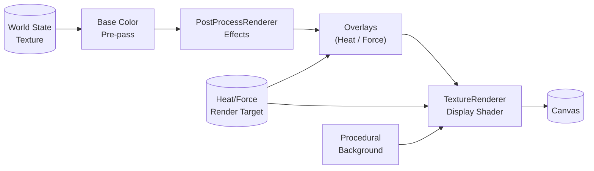

# Rendering System

The rendering stack converts the GPU-resident particle textures into a stylised scene with optional post-processing, overlays, and procedural backgrounds. All processing happens on the GPU; React merely wires texture refs and configuration into the shader pipeline.

## High-level Pipeline



## Base Color Pre-pass

The base color pass lives inside `TextureRenderer` and renders material colours into a dedicated `WebGLRenderTarget` whenever post-processing is enabled.

- Uses `baseColorVertexShader` / `baseColorFragmentShader` to map particle IDs to RGBA values.
- Runs once per frame and writes into a fixed-size render target (`WORLD_SIZE × WORLD_SIZE`).
- Keeps the canonical state texture untouched so simulation tools can continue to read raw data.

### Palette Overview

| Material | RGB | Notes |
| --- | --- | --- |
| Sand | (194, 178, 128) | Warm granular base |
| Dirt | (139, 90, 43) | Rich, darker soil |
| Water | (64, 164, 223) | Ocean blue, responds to liquid animation |
| Lava | (255, 80, 20) | High luminance for glow pass |
| Slime | (0, 255, 100) | Vivid greens for FX |

Colours are sourced from `MaterialDefinitions`/`ParticleColors` so rendering stays in sync with simulation metadata.

## Modular Post-processing (`PostProcessRenderer`)

`PostProcessRenderer` consumes the base colour texture and chains a set of configurable effect passes using two ping-pong render targets. Glow always runs last to preserve additive blending, while other effects execute in user-defined order.

### Effect Catalogue

| Effect | Shader | Key uniforms | Default | Purpose |
| --- | --- | --- | --- | --- |
| Edge blending | `edgeBlendingFragmentShader` | `uBlendStrength` | 0.5 | Softens hard pixel boundaries. |
| Material variation | `materialVariationFragmentShader` | `uNoiseScale`, `uNoiseStrength` | 4.0 / 0.15 | Adds FBM-driven texture detail. |
| Glow | `glowFragmentShader` | `uGlowIntensity`, `uGlowRadius` | 0.7 / 2.6 | Creates emissive halos around hot materials. |

Disabled effects skip both render target swaps and draw calls, keeping the pipeline lean on low-end GPUs.

## Overlay System

After the core effects, the renderer can composite diagnostic overlays using the latest state and heat textures shared through refs.

- **Particle heat overlay** – Shades per-particle temperatures.
- **Ambient heat overlay** – Visualises the shared heat/force map; requires a valid heat texture.
- **Combined heat overlay** – When both overlays are active, a specialised shader renders them in a single pass to save bandwidth.
- **Force overlay** – Decodes vector forces from the heat texture (B/A channels).

Each overlay reuses the ping-pong targets and exposes a uniform `uOverlayStrength` (default 0.7) for quick tuning.

## TextureRenderer Display Shader

The final shader (`rendererShader`) draws either the base state or the fully processed colour texture on a screen-covering quad.

### Camera & Zoom

- `uPixelSize` controls zoom (1.0 = 1 pixel per particle).
- `uCenter` stores the world-space focal point, updated by `useTextureControls` to enable click-and-drag panning.
- Coordinate conversion mirrors the CPU drawing hook to keep interaction maths consistent.

### Procedural Backgrounds

`App.tsx` randomises palette, seed, and noise offsets on resets/level loads. The shader:

- Accepts up to six palette colours (`uBackgroundPalette`).
- Samples layered noise with offsets from `uBackgroundNoiseOffsets` for subtle motion.
- Falls back to the colour texture when backgrounds are disabled (e.g., for clean screenshots).

### Liquid Animation

Liquids (particle IDs 64–111) receive a dual-layer noise modulation driven by `uTime` to create gentle shimmer. Brightness varies by ±8%, and a small colour shift keeps motion visible without overpowering the materials.

### Out-of-bounds Guard

Pixels outside the world texture fall back to a dark checkered pattern so players can identify view limits while panning.

## Heat Texture Integration

`TextureRenderer` receives a heat render target ref from `MainSimulation`. This allows:

- Overlay shaders to access fresh ambient data without triggering GPU read-backs.
- Inspect mode to highlight temperature fields in real time.
- Future FX (e.g., refractive heat haze) to reuse the same textures.

## Render Configuration Summary

```typescript
const DEFAULT_RENDER_CONFIG = {
  effects: [
    { type: 'edge-blending', enabled: true },
    { type: 'material-variation', enabled: true },
    { type: 'glow', enabled: true }
  ],
  overlays: [
    { type: 'heat', enabled: false },
    { type: 'ambient-heat', enabled: false },
    { type: 'force', enabled: false }
  ],
  edgeBlending: { blendStrength: 0.5 },
  materialVariation: { noiseScale: 4.0, noiseStrength: 0.15 },
  glow: { intensity: 0.7, radius: 2.6 }
};
```

| Setting | Range | Impact |
| --- | --- | --- |
| `blendStrength` | 0 → 1 | Higher values blur boundaries more aggressively. |
| `noiseScale` | 0.5 → 10 | Larger numbers create finer FBM detail. |
| `noiseStrength` | 0 → 1 | Controls contrast of variation patterns. |
| `glow.intensity` | 0 → 2 | Amplifies emissive halos. |
| `glow.radius` | 0.5 → 4 | Expands glow sample footprint. |

## Performance Tips

- Post-process resources are created once and disposed on unmount to avoid shader recompilation costs.
- Effects and overlays short-circuit when disabled, so toggling them off is effectively free.
- The base colour pre-pass only runs when post-processing is active; pure state rendering skips the extra target.
- All render targets use `NearestFilter` to keep sampling bandwidth low and preserve pixel art fidelity.

## Future Enhancements

- [ ] Bloom or tone-mapped highlights for high-energy materials.
- [ ] Particle overlay sprites (sparks, steam wisps) built on instancing.
- [ ] User-selectable background themes and HDR screenshots.
- [ ] Simple light accumulation to add depth without heavy shadow maps.
- [ ] GPU-side histogram capture for adaptive colour grading.
