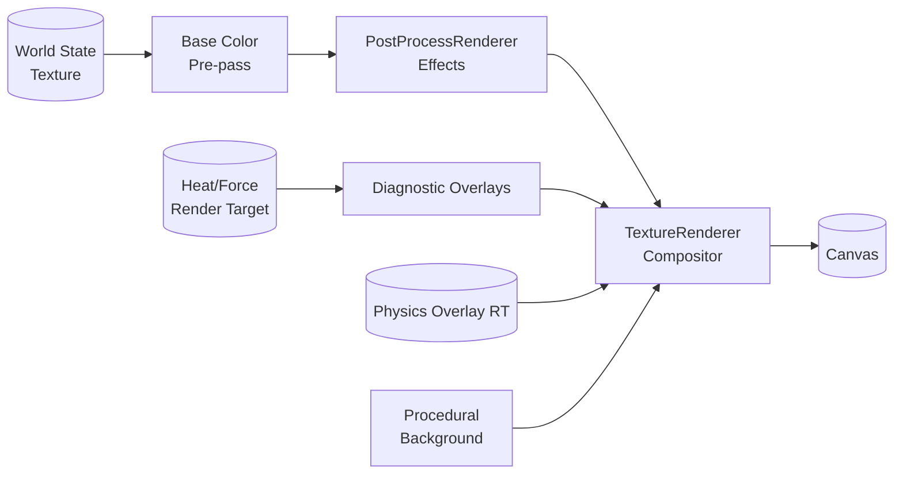

# Rendering System

The rendering stack converts the GPU-resident particle textures into a stylised scene with optional post-processing, overlays, physics debris, and procedural backgrounds. Almost all work happens on the GPU; React wires texture refs, configuration, and the physics render target into the shader pipeline.

## High-level Pipeline



## Base Color Pre-pass

The base color pass lives inside `TextureRenderer` and renders material colours into a dedicated `WebGLRenderTarget` whenever post-processing is enabled.

- Uses `baseColorVertexShader` / `baseColorFragmentShader` to map particle IDs to RGBA values.
- Runs once per frame and writes into a fixed-size render target (`WORLD_SIZE × WORLD_SIZE`).
- Keeps the canonical state texture untouched so simulation tools can continue to read raw data.

### Palette Overview

| Material | RGB             | Notes                                    |
| -------- | --------------- | ---------------------------------------- |
| Sand     | (194, 178, 128) | Warm granular base                       |
| Dirt     | (139, 90, 43)   | Rich, darker soil                        |
| Water    | (64, 164, 223)  | Ocean blue, responds to liquid animation |
| Lava     | (255, 80, 20)   | High luminance for glow pass             |
| Slime    | (0, 255, 100)   | Vivid greens for FX                      |

Colours are sourced from `MaterialDefinitions`/`ParticleColors` so rendering stays in sync with simulation metadata.

## Modular Post-processing (`PostProcessRenderer`)

`PostProcessRenderer` consumes the base colour texture and chains a set of configurable effect passes using two ping-pong render targets. Glow always runs last to preserve additive blending, while other effects execute in user-defined order.

### Effect Catalogue

| Effect             | Shader                            | Key uniforms                    | Default    | Purpose                                      |
| ------------------ | --------------------------------- | ------------------------------- | ---------- | -------------------------------------------- |
| Edge blending      | `edgeBlendingFragmentShader`      | `uBlendStrength`                | 0.5        | Softens hard pixel boundaries.               |
| Material variation | `materialVariationFragmentShader` | `uNoiseScale`, `uNoiseStrength` | 4.0 / 0.15 | Adds FBM-driven texture detail.              |
| Glow               | `glowFragmentShader`              | `uGlowIntensity`, `uGlowRadius` | 0.7 / 2.6  | Creates emissive halos around hot materials. |

Disabled effects skip both render target swaps and draw calls, keeping the pipeline lean on low-end GPUs.

## Overlay System

After the core effects (and optional physics overlay), the renderer can composite diagnostic overlays using the latest state and heat textures shared through refs.

- **Particle heat overlay** – Shades per-particle temperatures.
- **Ambient heat overlay** – Visualises the shared heat/force map; requires a valid heat texture.
- **Combined heat overlay** – When both overlays are active, a specialised shader renders them in a single pass to save bandwidth.
- **Force overlay** – Decodes vector forces from the heat texture (B/A channels) and can optionally reveal physics collision rectangles for debugging.

Each overlay reuses the ping-pong targets and exposes a uniform `uOverlayStrength` (default 0.7) for quick tuning.

## TextureRenderer Display Shader

The final shader (`rendererShader`) draws either the base state or the fully processed colour texture on a screen-covering quad.

- When physics is enabled it also samples `uPhysicsTexture`, blending Rapier debris and optional collider rectangles on top of the scene with premultiplied alpha.

### Camera & Zoom

- `uPixelSize` controls zoom (1.0 = 1 pixel per particle).
- `uCenter` stores the world-space focal point, updated by `useTextureControls` to enable click-and-drag panning.
- Coordinate conversion mirrors the CPU drawing hook to keep interaction maths consistent.
- When the player is active, `App.tsx` lerps `centerRef` toward their position each frame so the shader receives a smooth follow target without triggering React re-renders.

### Procedural Backgrounds

`App.tsx` randomises palette, seed, and noise offsets on resets/level loads. The shader:

- Accepts up to six palette colours (`uBackgroundPalette`).
- Samples layered noise with offsets from `uBackgroundNoiseOffsets` for subtle motion.
- Falls back to the colour texture when backgrounds are disabled (e.g., for clean screenshots).

### Liquid Animation

Liquids (particle IDs 64–111) receive a dual-layer noise modulation driven by `uTime` to create gentle shimmer. Brightness varies by ±8%, and a small colour shift keeps motion visible without overpowering the materials.

### Physics Overlay

`TextureRenderer` samples an additional render target generated by `PhysicsRenderer`. This Three.js helper renders CPU-simulated debris as point sprites and rigid bodies as instanced quads/circles, mirroring the `PhysicsManager` buffers each frame.

- Particle colours are sourced from `ParticleTypes`, ensuring the overlay matches the materials reintegrated into the grid.
- Instanced meshes allow dozens of rigid bodies to render without reallocating geometry; their transforms are updated in-place before the pass.
- When the force overlay is enabled, collision rectangles extracted from Rapier colliders can be toggled on for debugging.
- If physics is disabled or no debris is active, the overlay short-circuits and the compositor receives a `null` texture, avoiding extra blending work.

### Player Overlay

`TextureRenderer` reads player state directly from `PlayerManager` each frame and feeds it into the display shader via uniforms such as `uPlayerPosition`, `uPlayerWalkPhase`, and body dimension parameters.

- The sprite is procedural: head, torso, legs, and feet are drawn from simple geometric primitives in the fragment shader.
- Colours are authored in TypeScript and sent down as linear RGB vectors so palette swaps remain trivial.
- When the player is disabled the shader simply skips the overlay, avoiding extra draw calls or depth layers.

### Out-of-bounds Guard

Pixels outside the world texture fall back to a dark checkered pattern so players can identify view limits while panning.

## Heat Texture Integration

`TextureRenderer` receives a heat render target ref from `MainSimulation`. This allows:

- Overlay shaders to access fresh ambient data without triggering GPU read-backs.
- Inspect mode to highlight temperature fields in real time.
- Future FX (e.g., refractive heat haze) to reuse the same textures.

## Render Configuration Summary

```typescript
const DEFAULT_RENDER_CONFIG = {
  effects: [
    { type: 'edge-blending', enabled: true },
    { type: 'material-variation', enabled: true },
    { type: 'glow', enabled: true },
  ],
  overlays: [
    { type: 'heat', enabled: false },
    { type: 'ambient-heat', enabled: false },
    { type: 'force', enabled: false },
  ],
  edgeBlending: { blendStrength: 0.5 },
  materialVariation: { noiseScale: 4.0, noiseStrength: 0.15 },
  glow: { intensity: 0.7, radius: 2.6 },
};
```

| Setting          | Range    | Impact                                           |
| ---------------- | -------- | ------------------------------------------------ |
| `blendStrength`  | 0 → 1    | Higher values blur boundaries more aggressively. |
| `noiseScale`     | 0.5 → 10 | Larger numbers create finer FBM detail.          |
| `noiseStrength`  | 0 → 1    | Controls contrast of variation patterns.         |
| `glow.intensity` | 0 → 2    | Amplifies emissive halos.                        |
| `glow.radius`    | 0.5 → 4  | Expands glow sample footprint.                   |

## Performance Tips

- Post-process resources are created once and disposed on unmount to avoid shader recompilation costs.
- Effects and overlays short-circuit when disabled, so toggling them off is effectively free.
- The base colour pre-pass only runs when post-processing is active; pure state rendering skips the extra target.
- All render targets use `NearestFilter` to keep sampling bandwidth low and preserve pixel art fidelity.

## Future Enhancements

- [ ] Bloom or tone-mapped highlights for high-energy materials.
- [ ] Particle overlay sprites (sparks, steam wisps) built on instancing.
- [ ] User-selectable background themes and HDR screenshots.
- [ ] Simple light accumulation to add depth without heavy shadow maps.
- [ ] GPU-side histogram capture for adaptive colour grading.
