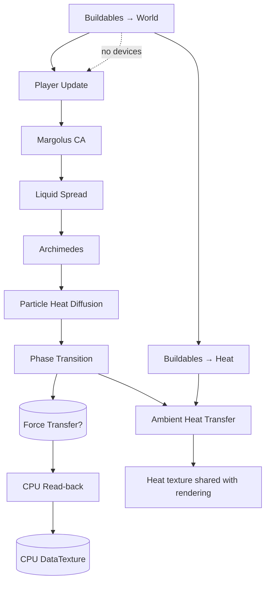

# Simulation Pipeline

The simulation loop is a configurable sequence of GPU shader passes orchestrated by `MainSimulation`. Each frame executes buildable effects, particle rules, and heat diffusion before syncing the final state back to the CPU exactly once. Optional passes remain in the pipeline configuration but skip execution when disabled.

## Frame Timeline



`Force Transfer` is optional—when disabled the pipeline jumps straight from phase transitions to the read-back without extra render target swaps.

## Buildables Pre-passes

### 0. Buildables → World (Material Sources & Sinks)

- Pulls device placement & configuration from the buildables manager (`positionTexture`, `dataTexture`).
- Injects or removes particles (e.g., material spawners, void sinks) before the main passes so downstream physics sees the updated state.
- Uniforms include `uMaxBuildables`, time, and world size for deterministic emission.

### 0b. Buildables → Heat (Heaters & Coolers)

- Writes heater/cooler contributions into the heat render target pool.
- Runs only when devices exist, otherwise the pass is skipped to avoid extra GPU work.
- Shares the same ping-pong targets as ambient diffusion to keep allocations stable.

## Player Update Pass

Executed immediately after buildable passes, the player shader maintains a sprite-like entity without injecting new particles.

- Samples the current world texture to resolve collisions, grounded state, and displacement forces for the articulated player body.
- Writes the results to a 4×4 floating-point render target that the CPU consumes to update position, velocity, and animation phase.
- Leaves the particle state untouched—the visible character is rendered as an overlay driven by the sampled physics outputs.
- Splits collision handling into solid displacement (direct positional offsets) and fluid buoyancy (velocity impulse) so liquids and gases can lift or sink the avatar based on material density and the configurable `pushOutStrength`.

When the player is disabled, the pass short-circuits and avoids both the draw call and the read-back.

With the player step complete (when enabled), the remaining particle passes mutate the world texture using four rotating render targets in the order below.

## 1. Margolus Cellular Automaton

### Overview

A 2×2 block-based automaton that simulates granular settling. The default configuration runs **8 passes**, which equals two complete parity cycles per frame.

### Key Mechanics

- Alternates block parity every pass to prevent directional bias.
- Samples per-material friction from `MaterialDefinitions` and multiplies it by the global `uFrictionAmplifier`.
- Uses a seeded random uniform to jitter outcome probabilities so packed piles break up naturally.

```glsl
float toppleProbability = 1.0 - clamp(baseFriction * uFrictionAmplifier, 0.0, 1.0);
if (rand(uRandomSeed, blockCoord) < toppleProbability) {
    swapCells();
}
```

### Typical Friction Coefficients

| Material | Base friction |
| -------- | ------------- |
| Sand     | 0.30          |
| Dirt     | 0.50          |
| Gravel   | 0.20          |
| Stone    | 1.00          |

## 2. Liquid Spread

### Overview

Evaluates every liquid pixel independently to encourage lateral leveling. The shader prefers deterministic movement (toward more empty space) and adds noise for organic flow.

### Highlights

- Checks immediate left/right neighbors and the cells beneath them to identify potential flow directions.
- Applies the same friction scaling as Margolus to modulate spread probability per material.
- Guardrails prevent oscillation by prioritizing the direction with more vertical headroom.

| Material       | Behavior                      |
| -------------- | ----------------------------- |
| Water (μ=0.10) | Rapid leveling and even fills |
| Lava (μ=0.40)  | Viscous, slower spread        |
| Slime (μ=0.60) | Sticky, rarely moves          |
| Acid (μ=0.20)  | Slightly slower than water    |

## 3. Archimedes Buoyancy

### Overview

Handles convection and density-driven swapping. Each 2×2 block compares effective densities and bubbles lighter materials upward.

### Temperature-aware Density

```glsl
float computeEffectiveDensity(float type, float temp) {
    float base = getMaterialDensity(type);
    float delta = temp - getMaterialDefaultTemperature(type);
    float coeff = chooseCoeffForState(type);
    return clamp(base - delta * coeff, base * 0.2, base * 3.5);
}
```

- Hot gases (coeff ≈ 1.4) rise quickly.
- Liquids (coeff ≈ 0.55) respond moderately.
- Solids (coeff ≈ 0.18) barely budge unless extremely heated.

## 4. Particle-only Heat Diffusion

### Overview

Runs **before the GPU read-back** so the CPU always sees the already-conducted temperatures. Operates purely on particle neighbors and optionally couples to the ambient layer via `uHeatmapCouplingMultiplier`.

### Notable Uniforms

- `uEmissionMultiplier` – Multiplies material emission/absorption rates.
- `uHeatForceLayer` – Reads the latest ambient map when coupling is > 0.

## 5. Phase Transition

### Overview

Evaluates each pixel against material thresholds (melting/boiling points) after diffusion settles. Transforms particle IDs and reinitializes default temperatures for the new material type.

### Examples

- Water → Steam when `temp ≥ boilingPoint`.
- Lava → Stone when `temp ≤ solidifyPoint`.
- Steam → Water when cooled by ambient diffusion or buildable chillers.

## 6. Ambient Heat Transfer

### Overview

Updates the ambient heat/force texture, diffusing energy from particles and devices through a 5×5 neighborhood.

### Controls (from `SimulationConfig.ambientHeatSettings`)

- `emissionMultiplier` – Scales how aggressively particles deposit heat.
- `diffusionMultiplier` – Controls spread through the environment.
- `equilibriumStrength` / `equilibriumTemperature` – Pulls the system toward a baseline temperature.
- `equilibriumInterval` – Applies equilibrium every N frames to reduce workload during idle periods.
- `heatmapCouplingMultiplier` – Influences the earlier particle-only diffusion pass.

### Conditional Read-back

When the inspector is open (`shouldCaptureHeatLayer = true`), the latest heat render target is copied to the CPU-visible `DataTexture` so hover tooltips can display ambient temperatures.

## Optional: Force Transfer

- Shares the same render target pool as other particle passes.
- Propagates vector forces encoded in the heat texture’s B/A channels.
- Disabled by default but safe to enable for experimentation.

## Temperature & Heat Data Model

| Channel | Particle state texture | Heat/force texture      |
| ------- | ---------------------- | ----------------------- |
| R       | Particle type          | Temp low byte           |
| G       | Temp low byte          | Temp high byte          |
| B       | Temp high byte         | Force X (128 = neutral) |
| A       | Reserved metadata      | Force Y (128 = neutral) |

- Both textures are `UnsignedByteType` for compatibility and bandwidth efficiency.
- Default temperatures are seeded from `MaterialDefinitions` so world resets stay deterministic.

## GPU Assets in Flight

- **Particle ping-pong ×4** – Keeps the particle state on the GPU through all simulation stages.
- **Heat ping-pong ×2** – Alternates ambient diffusion outputs without reallocating textures.
- **Buildables atlases** – Fixed-size textures describing device positions, parameters, and counts.
- **CPU-visible DataTextures** – `worldTexture` and `heatForceLayerRef` receive read-backs when required.

## CPU Sync & Tooling Hooks

1. After phase transitions (and optional force transfer) complete, the final particle render target is copied into `worldTexture` so painting, level saving, and analytics operate on the newest frame.
2. Heat read-back is conditional; only inspection or tooling actions trigger it, preserving frame budget otherwise.
3. `onFpsUpdate` aggregates frame times over a 60-sample circular buffer, smoothing HUD output without allocations.

## Pipeline Configuration

### Default Settings

```typescript
const DEFAULT_SIMULATION_CONFIG = {
  frictionAmplifier: 1.3,
  ambientHeatSettings: {
    emissionMultiplier: 0.3,
    diffusionMultiplier: 0.8,
    equilibriumStrength: 0.1,
    equilibriumTemperature: 298.0,
    equilibriumMaxDelta: 1,
    equilibriumInterval: 1,
    heatmapCouplingMultiplier: 2,
  },
  steps: [
    { type: 'player-update', passes: 10, enabled: false },
    { type: 'margolus-ca', passes: 8, enabled: true },
    { type: 'liquid-spread', passes: 4, enabled: true },
    { type: 'archimedes', passes: 2, enabled: true },
    { type: 'heat-transfer', passes: 2, enabled: true },
    { type: 'particle-only-heat', passes: 2, enabled: true },
    { type: 'phase-transition', passes: 1, enabled: true },
    { type: 'force-transfer', passes: 1, enabled: false },
  ],
};
```

### Adjustable Parameters

- **Friction amplifier** – Higher values slow granular flow; lower values make everything looser.
- **Pass counts** – Tweak individual `passes` fields to trade accuracy for performance (e.g., more heat passes for faster equilibration).
- **Ambient settings** – Exposed through the UI so high-energy scenes can relax or stay chaotic.

## Performance Notes

- Margolus operates on one quarter of the pixels per iteration (2×2 blocks), so 8 passes roughly equal 2 full screen sweeps.
- Liquid, Archimedes, heat, and phase passes are O(n); the GPU’s fragment parallelism keeps them within the 16 ms frame budget at 1024×1024 on mid-range hardware.
- Buildable passes short-circuit when no devices exist, keeping empty worlds lightweight.

## Known Limitations

1. Margolus still lacks diagonal motion and higher-order fluid dynamics.
2. Liquid spread is purely horizontal; vertical pressure and vortices remain approximated.
3. Force transfer is experimental and not yet integrated with gameplay systems.
4. Chemical reactions are limited to phase transitions; mixing systems are on the roadmap.

## Future Improvements

- [ ] Diagonal and vertical liquid pressure model.
- [ ] Velocity field to drive ambient convection.
- [ ] Cross-material reactions (e.g., water + lava → stone) inside the GPU pipeline.
- [ ] Extensible buildable scripting for custom device behaviors.
- [ ] GPU-side analytics (particle counts, heat histograms) to reduce CPU polling.
